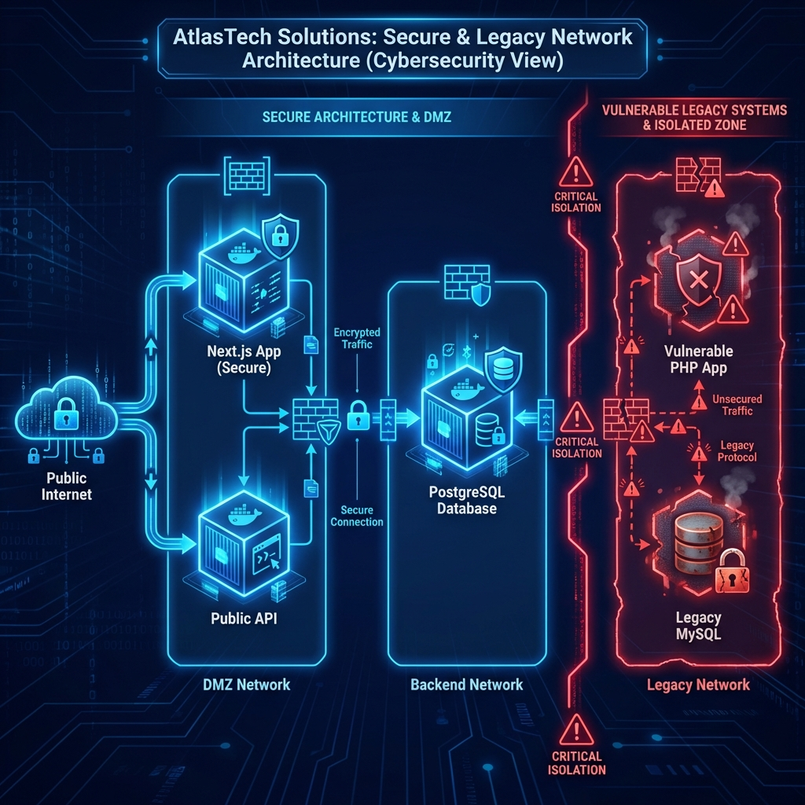
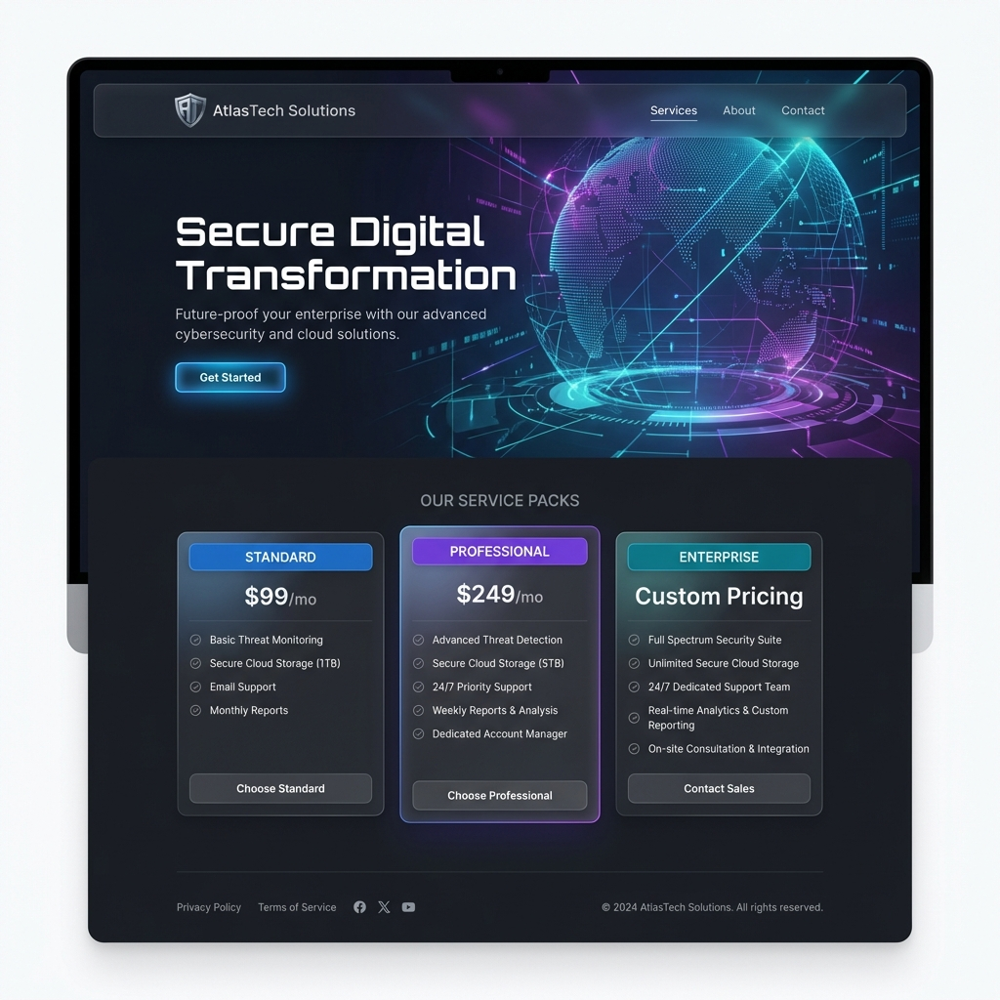

<div align="center">

<!-- Animated Header -->


<!-- Badges -->
<p>
  
  
  
  
</p>

<p>
  
  
  
</p>

<p>
  <a href="#-quick-start"></a>
  <a href="#-features"></a>
  <a href="#-documentation"></a>
</p>

---

### 🎯 Automated Security Assessment Lab for Windows Server 2025


</div>

## 👨‍💻 Created By

<div align="center">
<table>
<tr>
<td align="center">
<a href="https://github.com/jalalmansour">

<br />
<sub><b>Jalal Mansour</b></sub>
</a>
<br />
<a href="https://github.com/jalalmansour" title="GitHub">🔗 GitHub</a>
</td>
</tr>
</table>

**🇲🇦 Moroccan Cybersecurity Professional | Full-Stack Developer | Blue Hat Security Researcher**

</div>

---

## 🌟 Overview

**AtlasTech Security Framework** is an enterprise-grade, CLI-driven penetration testing and infrastructure control platform. Designed for professional security assessments, it provides robust automation for VMware environments, deploys intentionally vulnerable applications, and executes precise attack vectors through a unified terminal interface.

### 🖼️ Architecture & Design

<div align="center">
  
  <br>
  <em>Secure Network Segmentation: DMZ vs Legacy Isolation</em>
  <br><br>
  
  <br>
  <em>Modern Digital Front-End (Next.js)</em>
</div>

<div align="center">

```
┌─────────────────────────────────────────────────────────────────┐
│                    🛡️ ATLASTECH FRAMEWORK                       │
├─────────────────────────────────────────────────────────────────┤
│                                                                  │
│   ┌─────────────┐    ┌─────────────┐    ┌─────────────┐        │
│   │   VMware    │───▶│  Vulnerable │───▶│   Attack    │        │
│   │   Control   │    │     App     │    │   Suite     │        │
│   └─────────────┘    └─────────────┘    └─────────────┘        │
│          │                  │                  │                │
│          └──────────────────┴──────────────────┘                │
│                             │                                   │
│                    ┌────────▼────────┐                          │
│                    │   CLI Console   │                          │
│                    │  (root@atlas)   │                          │
│                    └─────────────────┘                          │
│                                                                  │
└─────────────────────────────────────────────────────────────────┘
```

</div>

---

## ✨ Features

<div align="center">

| 🖥️ VM Control | 🌐 Vulnerable App | ⚔️ Attack Suite | 💻 CLI Console |
|:-------------:|:-----------------:|:---------------:|:------------:|
| Start/Stop VMs | SQL Injection | SSH Brute Force | Logging & Audits |
| Snapshot Mgmt | IDOR Flaws | Password Spray | Robust Error Handling |
| IP Detection | XSS Vectors | Network Scan | Git Sync Integration |
| Script Exec | CSRF Missing | Data Exfil | Automation Ready |

</div>

### 🎛️ Core Capabilities

<details>
<summary><b>🖥️ VMware Workstation Control</b></summary>

- ✅ Start/Stop VMs via `vmrun.exe`
- ✅ Automatic IP address detection
- ✅ Snapshot creation & management
- ✅ PowerShell script execution in guest
- ✅ File transfer Host ↔ Guest

</details>

<details>
<summary><b>🌐 Vulnerable HR Application</b></summary>

- 💉 **SQL Injection** in login, add, edit, delete
- 🔓 **IDOR** (Insecure Direct Object Reference)
- 🍪 **Missing CSRF Protection**
- 🔑 **Plaintext Password Storage**
- 📂 **Sensitive Data Exposure** (SSN, Banking)
- 🎨 **Modern Glassmorphism UI**

</details>

<details>
<summary><b>⚔️ Attack Suite</b></summary>

- 🔍 Professional Reconnaissance with Nmap Integration
- 🔐 SSH Brute Force (Multi-threaded)
- 💉 Automated SQL Injection Detection
- ⚙️ Automated Logging and Reporting

</details>

---

## 🚀 Quick Start

### Prerequisites

```bash
# Python 3.10+
# VMware Workstation (with vmrun.exe)
# Windows Server 2025 VM
# Nmap (Added to System PATH)
```

### Installation

```bash
# 1. Clone the repository
git clone https://github.com/jalalmansour/AtlasTech.git
cd AtlasTech

# 2. Install dependencies
pip install -r requirements.txt

# 3. Configure your environment
# Edit config.py with your VMX path and credentials
```

### Usage

**Launch the Interactive Console:**
```bash
python main.py
```

**Automated Deployment:**
```bash
python main.py --deploy
```

<div align="center">

</div>

---

## 📁 Project Structure

```
AtlasTech/
├── 🎯 main.py                  # CLI Entry Point & Controller
├── ⚙️ config.py                # Configuration settings
├── 📋 requirements.txt         # Python dependencies
│
├── 📂 infrastructure/
│   ├── 🖥️ vm_manager.py       # VMware control via vmrun
│   └── 🔧 provisioner.py      # Windows deployment
│
├── 📂 webapp/rh_crud/          # Vulnerable HR Application
│   ├── 🔐 login.php           # Auth bypass (SQLi)
│   ├── 📄 index.php           # Employee listing
│   └── 🗄️ setup.sql           # Database schema
│
└── 📂 attack_suite/
    ├── 🔍 recon.py            # Reconnaissance Scanner (Nmap)
    └── ⚔️ exploits.py         # Exploitation Modules
```

---

## ⚠️ Legal Disclaimer

<div align="center">

> **🔒 AUTHORIZED USE ONLY**
>
> This framework is designed for **authorized penetration testing** and **security research** only.
> 
> ✅ Use in controlled lab environments<br>
> ✅ Get written authorization before testing<br>
> ✅ Follow Moroccan Law 07-03 guidelines<br>
> ❌ Never use against systems without permission

</div>

---

## 📜 License

<div align="center">

This project is licensed under the **MIT License** - see the [LICENSE](LICENSE) file for details.


</div>

---

## 📞 Contact

<div align="center">

<a href="https://github.com/jalalmansour">
  
</a>

</div>

---

<div align="center">

<!-- Animated Footer -->


</div>
